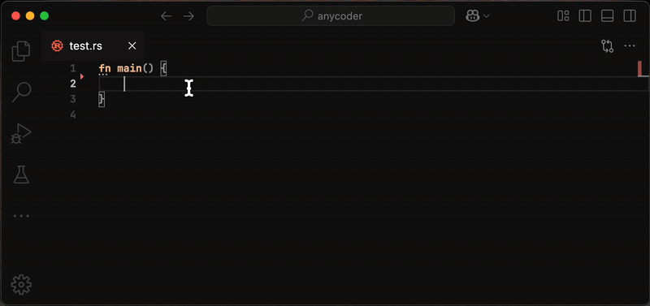

# anycoder

An intelligent code completion tool that watches your files and automatically suggests completions when you place a `??` in your code.  

It doesn't matter what editor or IDE you're using — as long as the file is saved, `anycoder` can update help you.

## Demo 



## Features

- **Real-time file watching**: Monitors your project files for changes
- **AI-powered completions**: Uses LLM models to generate intelligent code suggestions
- **Cursor-based triggering**: Simply add `??` where you want code completion
- **Multi-language support**: Works with any programming language
- **Automatic file updates**: Seamlessly replaces the cursor marker with generated code

## How it works

1. anycoder watches all files in your project directory
2. When you save a file containing the `??` marker, it detects the change
3. The AI analyzes the surrounding context and generates appropriate code
4. The generated code automatically replaces the `??` marker in your file

## Setup

### Prerequisites

- Rust (latest stable version)
- An OpenRouter API key

### Installation

1. Clone the repository:
```bash
git clone https://github.com/vipmax/anycoder.git
cd anycoder
```
2. Install the project:
```bash
cargo install --path .
```
Then `anycoder` will be abailable from terminal

### Configuration
You need to provider OPENROUTER_API_KEY to anycoder.
You can do it in many differrent ways:
- Set the environment variable `export OPENROUTER_API_KEY=` in the terminal 
- Create a .env file in the root of the project with the following content: `OPENROUTER_API_KEY=`
- Set `OPENROUTER_API_KEY` in your shell config like `~/.bashrc`

## Usage

1. Start anycoder in your project directory:
```bash
anycoder
```

2. In any file you're working on, place the `??` marker where you want code completion:

```rust
fn main() {
    for i in 0..5 {
        println!("Current value: {}", );
    }
}
```

3. Save the file. anycoder will automatically detect the change and replace `??` with appropriate code:

```rust
fn main() {
    for i in 0..5 {
        println!("Current value: {}", i);
    }
}
```

## Architecture

`anycoder` consists of several key components:

- **File Watcher**: Uses the `notify` crate to monitor file system changes
- **LLM Client**: Interfaces with OpenRouter API for AI completions
- **Coder**: Handles context building and patch application
- **Diff Engine**: Computes text edits using the `similar` crate

## Configuration

### Ignored Directories

`anycoder` automatically ignores common directories like:
- `.git`, `.idea`, `.vscode`
- `node_modules`, `dist`, `target`
- `__pycache__`, `.pytest_cache`
- Build and cache directories

### Model Configuration

`anycoder` supports configuration through environment variables:

- `OPENROUTER_BASE_URL`: API base URL (defaults to `https://openrouter.ai/api/v1`)
- `OPENROUTER_MODEL`: Model to use (defaults to `mistralai/codestral-2501`)

## Contributing

1. Fork the repository
2. Create a feature branch
3. Make your changes
4. Add tests if applicable
5. Submit a pull request

## License

This project is licensed under the MIT License - see the LICENSE file for details.

## Troubleshooting

### Common Issues

1. **API Key not found**: Make sure your `.env` file contains `OPENROUTER_API_KEY`
2. **Files not being watched**: Check that files aren't in ignored directories
3. **No completions generated**: Ensure the `??` marker is present in your file
4. **Model not responding**: Verify your `OPENROUTER_MODEL` is valid and available
5. **API errors**: Check your `OPENROUTER_BASE_URL` is correct for your provider

### Debug Mode

Run with debug logging to see detailed information:

```bash
RUST_LOG=debug cargo run
```

This will show:
- File change events
- Context extraction
- LLM requests and responses
- Patch parsing and application

## Roadmap

- [ ] Custom ignore patterns configuration
- [ ] Users recent edits support 
- [ ] Errors from lsp 

## Support

If you encounter any issues or have questions, please open an issue on the GitHub repository.